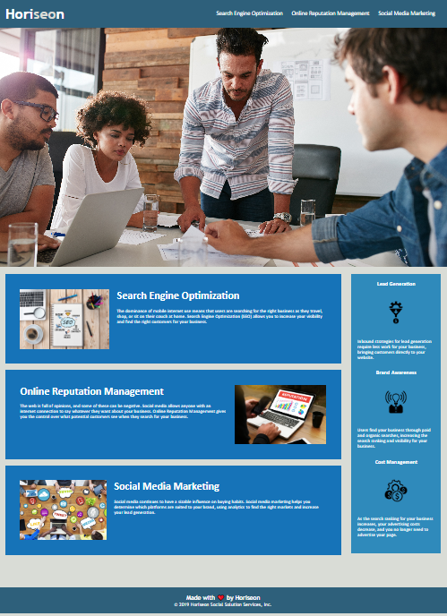

# Challenge-1 Horiseon Webpage 
## HTML, CSS, and Git: Code Refactor & Accessibility

## Description

This first challege required refactoring of CSS code, as well as bug fixes. Code added to create the webpage more accessible.

## Motivation

Accessibility was part of some of the small changes such as making it keyboard accessible and adding a background to the footer with better contrast. While also refactoring portions of the CSS code, eliminating duplicate code.

## Comments

Comments were added to at first help myself identify tags within the code and where that code appeared on the page. I also added comments for any addition I did with the reason. There were also some comments with minor questions and/or ideas to possibly go back to and change.

## Screenshot

## Link to Application

https://jcgilbert70.github.io/challenge-1/

## Link to Repository

https://github.com/jcgilbert70/challenge-1.git

## Credits

N/A

## License

Please refer to the LISCENSE in the repo